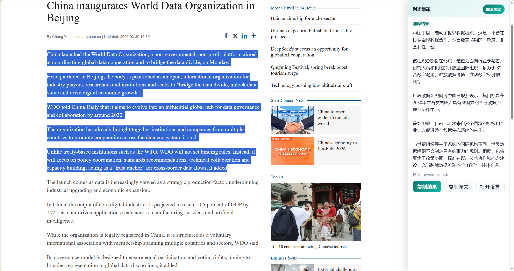
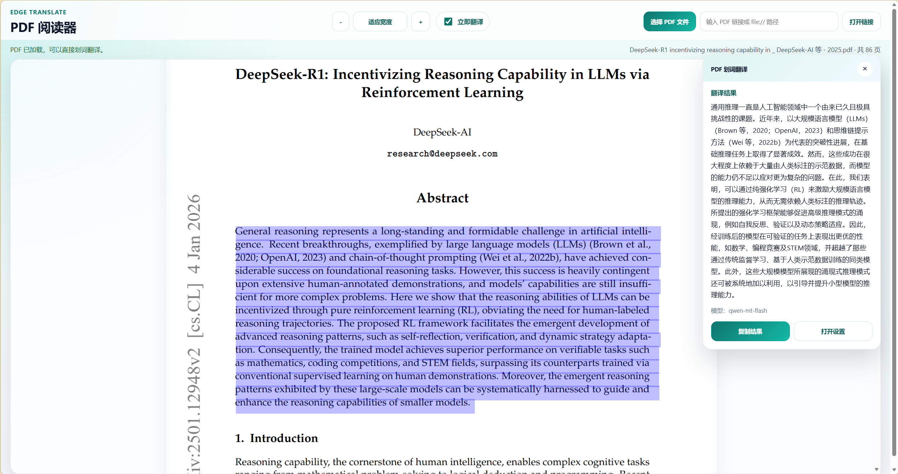
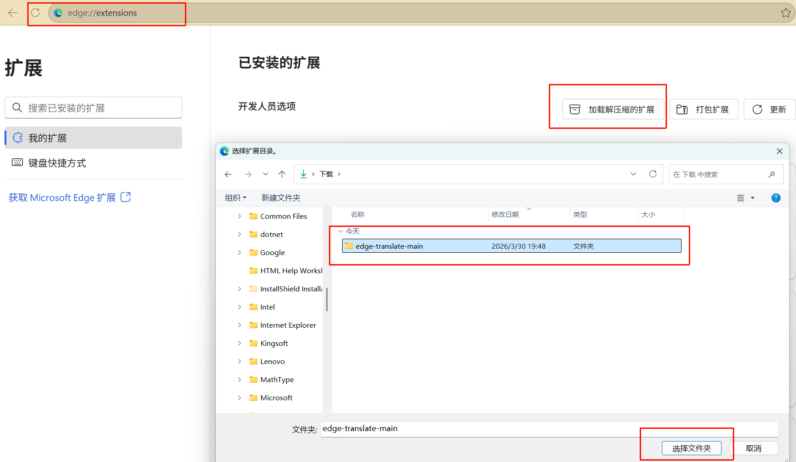
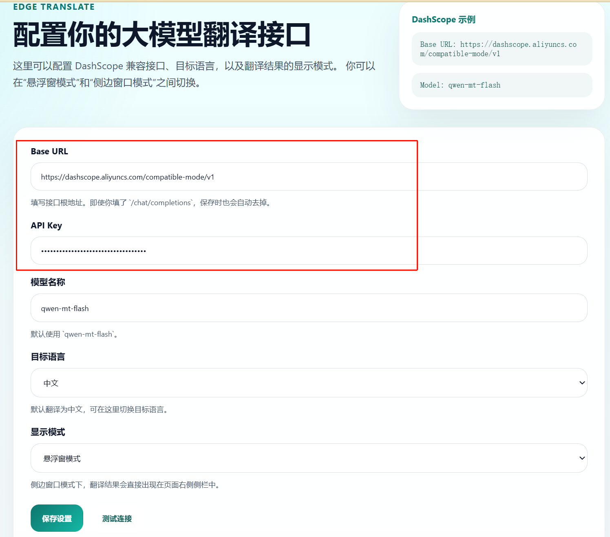

# Edge Translate

一个面向 Edge 浏览器的划词翻译插件，支持接入你自己配置的大模型 API。当前默认适配 DashScope 的 OpenAI 兼容接口，并使用 `qwen-mt` 系列模型进行翻译。

## 功能特性

- 支持网页划词翻译
- 支持配置自定义 `Base URL`
- 支持配置自定义 `API Key`
- 支持配置翻译模型名称
- 支持设置目标语言
- 支持两种结果展示模式
  - 悬浮窗模式
  - 侧边栏模式
- 支持浏览器工具栏快速设置
  - 可快速修改模型、目标语言、显示模式
- 支持复制翻译结果
- 支持复制原文
- 支持固定翻译窗口
- 支持扩展内置 PDF 阅读器
  - 适用于 Edge 内置 PDF 查看器无法注入内容脚本的场景
  - 支持打开本地 PDF 文件
  - 支持在阅读器中打开当前 PDF
  - 支持 PDF 划词翻译

## 效果展示

### 悬浮窗模式


### 侧边栏模式



### PDF 翻译



## 适用接口

当前插件按 OpenAI 兼容的 `chat/completions` 方式调用模型，推荐直接使用 DashScope 兼容接口：

- Base URL: `https://dashscope.aliyuncs.com/compatible-mode/v1`
- Model: `qwen-mt-flash`

当前版本仅支持以下 `qwen-mt` 系列翻译模型：

- `qwen-mt-flash`
- `qwen-mt-lite`
- `qwen-mt-turbo`
- `qwen-mt-plus`

不建议在当前版本中配置普通对话模型或其他非 `qwen-mt` 模型，否则可能无法按预期返回翻译结果。

## 安装方式

### 方法一：本地加载开发版

1. 克隆或下载本项目到本地
2. 打开 Edge 浏览器，进入 `edge://extensions/`
3. 打开右上角“开发人员模式”
4. 点击“加载解压缩的扩展”
5. 选择当前项目目录
6. 加载完成后，可点击扩展详情中的“扩展选项”，或点击工具栏图标进行配置



### 方法二：直接加载源码目录

如果你已经拿到仓库源码，也可以直接加载当前目录：

1. 打开 `edge://extensions/`
2. 开启“开发人员模式”
3. 点击“加载解压缩的扩展”
4. 选择仓库根目录

## 首次配置

加载完成后，请先配置模型参数：

1. 点击浏览器工具栏中的插件图标，打开“快速设置”
2. 或进入完整设置页
3. 填写以下信息
   - `Base URL`
   - `API Key`
   - `Model`
   - `Target Language`
   - `Display Mode`



推荐配置如下：

- Base URL: `https://dashscope.aliyuncs.com/compatible-mode/v1`
- Model: `qwen-mt-flash`
- Target Language: `Chinese`

## 使用说明

### 悬浮窗模式

1. 在网页中选中任意文本
2. 鼠标附近会出现翻译按钮
3. 点击按钮后显示翻译结果
4. 可在结果窗口中复制译文、复制原文、打开设置、固定窗口

### 侧边栏模式

1. 在设置中将显示模式切换为“侧边窗口模式”
2. 在网页中划词后，结果会显示在页面右侧侧边栏
3. 默认是抽屉式侧栏，点击窗口外区域会收起
4. 点击“固定”后，侧栏会保持常驻
5. 固定状态下再次划词，结果会直接刷新到当前侧栏中

## 工具栏弹窗

点击浏览器工具栏中的插件图标后，可以快速修改：

- 模型名称
- 目标语言
- 显示模式
- 打开 PDF 阅读器
- 在 PDF 阅读器中打开当前 PDF

如果需要修改 `Base URL` 和 `API Key`，请点击弹窗中的“完整设置”进入设置页。

## PDF 翻译

由于 Edge 内置 PDF 查看器通常无法注入扩展内容脚本，因此直接在浏览器原生 PDF 页面里划词时，插件不会显示翻译按钮或侧边栏。

当前项目提供了扩展内置 PDF 阅读器，使用方式如下：

1. 点击浏览器工具栏中的插件图标
2. 点击“打开 PDF 阅读器”
3. 在阅读器中：
   - 选择本地 PDF 文件
   - 或输入 PDF 链接打开
   - 或点击“在阅读器中打开当前 PDF”
4. 在 PDF 页面中划词后进行翻译

内置 PDF 阅读器支持：

- 划词翻译
- 立即翻译开关
- 复制翻译结果
- 缩放阅读


## 项目结构

- `manifest.json`：扩展清单
- `background.js`：后台请求与配置读取
- `content.js`：网页划词交互、悬浮窗和侧边栏逻辑
- `content.css`：页面注入 UI 样式
- `options.html` / `options.js` / `options.css`：完整设置页
- `popup.html` / `popup.js` / `popup.css`：工具栏快速设置弹窗
- `pdf-viewer.html` / `pdf-viewer.js` / `pdf-viewer.css`：扩展内置 PDF 阅读器
- `vendor/openai/`：随项目分发的 OpenAI SDK
- `vendor/pdfjs/`：PDF.js 阅读器依赖
- `imgs/`：README 展示图片

## 本地调试

项目中还提供了一个独立测试脚本：

- `test-qwen-mt-flash.js`

可用于在本地直接测试 DashScope 翻译请求是否正常。

示例：

```powershell
$env:DASHSCOPE_API_KEY="sk-xxx"
node .\test-qwen-mt-flash.js "Hello world" Chinese
```

## 说明

- 当前项目主要面向 Edge 浏览器，也可尝试加载到其他 Chromium 内核浏览器
- 若修改了源码，请在 `edge://extensions/` 中点击刷新扩展后再测试
